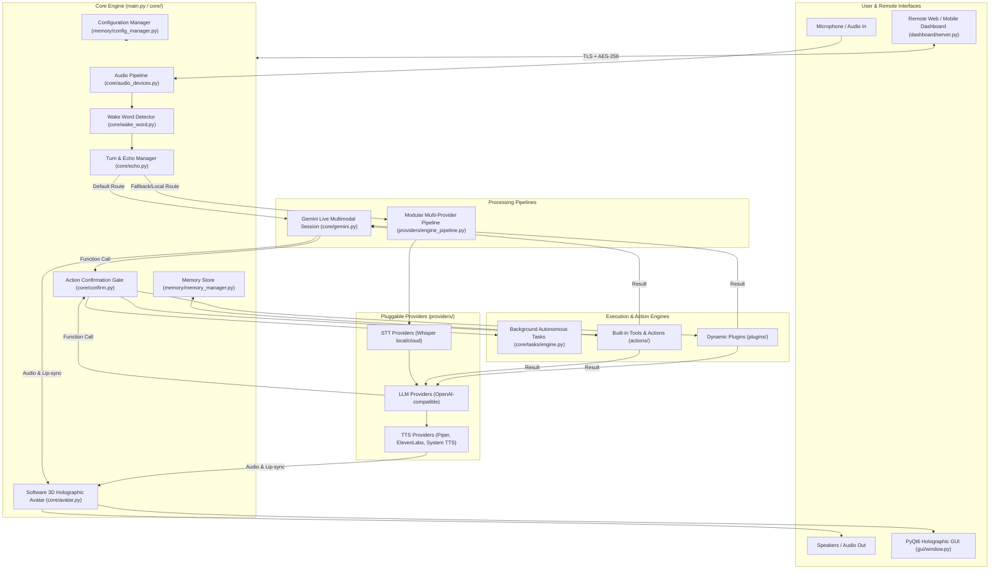

# System Architecture Diagram

```mermaid
graph TB
    subgraph ClientInterfaces ["User & Remote Interfaces"]
        MicIn["Microphone / Audio In"]
        SpeakerOut["Speakers / Audio Out"]
        QtGUI["PyQt6 Holographic GUI (gui/window.py)"]
        WebDashboard["Remote Web / Mobile Dashboard (dashboard/server.py)"]
    end

    subgraph CoreEngine ["Core Engine (main.py / core/)"]
        AudioDev["Audio Pipeline (core/audio_devices.py)"]
        WakeWord["Wake Word Detector (core/wake_word.py)"]
        TurnMgr["Turn & Echo Manager (core/echo.py)"]
        Avatar3D["Software 3D Holographic Avatar (core/avatar.py)"]
        ConfigMgr["Configuration Manager (memory/config_manager.py)"]
        MemoryMgr["Memory Store (memory/memory_manager.py)"]
        ConfirmGate["Action Confirmation Gate (core/confirm.py)"]
    end

    subgraph ProcessingPipelines ["Processing Pipelines"]
        GeminiLive["Gemini Live Multimodal Session (core/gemini.py)"]
        LocalPipeline["Modular Multi-Provider Pipeline (providers/engine_pipeline.py)"]
    end

    subgraph ProvidersLayer ["Pluggable Providers (providers/)"]
        STT["STT Providers (Whisper local/cloud)"]
        LLM["LLM Providers (OpenAI-compatible)"]
        TTS["TTS Providers (Piper, ElevenLabs, System TTS)"]
    end

    subgraph ExecutionLayer ["Execution & Action Engines"]
        TaskEngine["Background Autonomous Tasks (core/tasks/engine.py)"]
        Actions["Built-in Tools & Actions (actions/)"]
        Plugins["Dynamic Plugins (plugins/)"]
    end

    MicIn --> AudioDev
    AudioDev --> WakeWord
    WakeWord --> TurnMgr
    TurnMgr -->|Default Route| GeminiLive
    TurnMgr -->|Fallback/Local Route| LocalPipeline

    LocalPipeline --> STT
    STT --> LLM
    LLM --> TTS

    GeminiLive -->|Function Call| ConfirmGate
    LLM -->|Function Call| ConfirmGate

    ConfirmGate --> Actions
    ConfirmGate --> Plugins
    ConfirmGate --> TaskEngine

    Actions -->|Result| GeminiLive
    Actions -->|Result| LLM
    Plugins -->|Result| GeminiLive
    Plugins -->|Result| LLM

    GeminiLive -->|Audio & Lip-sync| Avatar3D
    TTS -->|Audio & Lip-sync| Avatar3D
    Avatar3D --> QtGUI
    Avatar3D --> SpeakerOut

    ConfigMgr <--> CoreEngine
    MemoryMgr <--> Actions
    WebDashboard <-->|TLS + AES-256| CoreEngine
```
