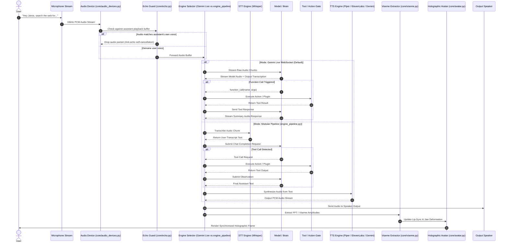

# Voice Processing Pipeline Diagram

```mermaid
sequenceDiagram
    autonumber
    actor User as User
    participant Mic as Microphone Stream
    participant AudioDev as Audio Device (core/audio_devices.py)
    participant Echo as Echo Guard (core/echo.py)
    participant Engine as Engine Selector (Gemini Live vs engine_pipeline)
    participant STT as STT Engine (Whisper)
    participant LLM as Model / Brain
    participant Tool as Tool / Action Gate
    participant TTS as TTS Engine (Piper / ElevenLabs / Gemini)
    participant Viseme as Viseme Extractor (core/viseme.py)
    participant Avatar as Holographic Avatar (core/avatar.py)
    participant Speaker as Output Speaker

    User->>Mic: "Hey Jarvis, search the web for..."
    Mic->>AudioDev: 16kHz PCM Audio Stream
    AudioDev->>Echo: Check against assistant playback buffer
    alt Audio matches assistant's own voice
        Echo-->>AudioDev: Drop audio packet (Anti-echo self-cancellation)
    else Genuine user voice
        Echo->>Engine: Forward Audio Buffer
    end

    alt Mode: Gemini Live WebSocket (Default)
        Engine->>LLM: Stream Raw Audio Chunks
        LLM-->>Engine: Stream Model Audio + Output Transcription
        alt Function Call Triggered
            LLM-->>Engine: function_call(name, args)
            Engine->>Tool: Execute Action / Plugin
            Tool-->>Engine: Return Tool Result
            Engine->>LLM: Send Tool Response
            LLM-->>Engine: Stream Summary Audio Response
        end
    else Mode: Modular Pipeline (engine_pipeline.py)
        Engine->>STT: Transcribe Audio Chunk
        STT-->>Engine: Return User Transcript Text
        Engine->>LLM: Submit Chat Completion Request
        alt Tool Call Detected
            LLM-->>Engine: Tool Call Request
            Engine->>Tool: Execute Action / Plugin
            Tool-->>Engine: Return Tool Output
            Engine->>LLM: Submit Observation
            LLM-->>Engine: Final Assistant Text
        end
        Engine->>TTS: Synthesize Audio from Text
        TTS-->>Engine: Output PCM Audio Stream
    end

    Engine->>Speaker: Send Audio to Speaker Output
    Engine->>Viseme: Extract FFT / Viseme Amplitudes
    Viseme->>Avatar: Update Lip-Sync & Jaw Deformation
    Avatar->>User: Render Synchronized Holographic Frame
```
